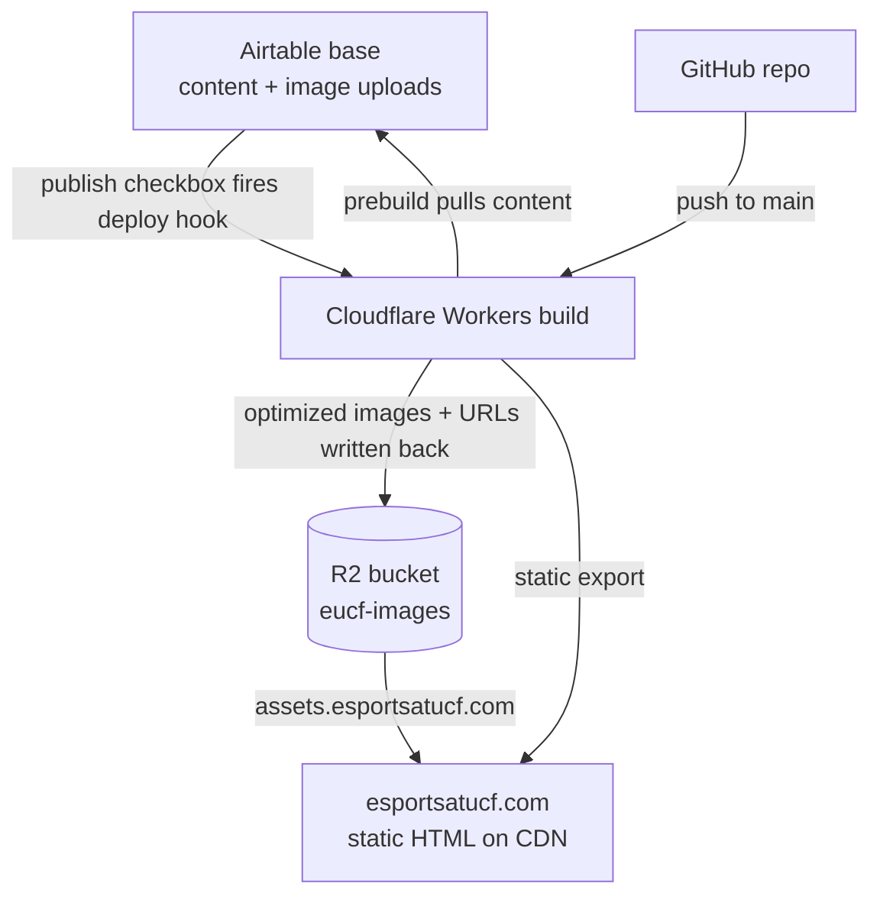

# Infrastructure Setup

For developers standing up this site's hosting — a new Cloudflare account, a rebuilt
Worker, or a handover to the next maintainer.

- Editing content day to day → [Content Runbook](RUNBOOK.md)
- Running the site locally → [README](../README.md)

**No real credentials appear in this file.** Anything in `<angle brackets>` comes from
your own dashboard and belongs in a password manager, never in the repo.

## Before you start

You need admin access to three things:

| System | Owns |
| --- | --- |
| Cloudflare account (club-owned) | the domain, the Worker, R2 |
| Airtable base (club-owned) | all site content |
| GitHub repository | the code the Worker builds from |

`esportsatucf.com` must already be an **active zone** in that Cloudflare account. Both the
R2 custom domain and the Worker custom domain require it.

## How it fits together



Two things trigger a deploy — an officer ticking `publish` in Airtable, and a developer
pushing to `main` — and **both build on Cloudflare**, using the Worker's build
variables. GitHub only stores the code.

GitHub Actions runs lint, typecheck, tests, and a build on every push, but **never
deploys and holds no secrets**. Without Airtable credentials the sync exits 0 and CI
builds against the committed JSON — which carries the real titles, officers, sponsors
and about content, but an intentionally empty `players.json`, so CI renders every game
page in its "Roster coming soon" state. That keeps CI deterministic and keeps
write-scoped production credentials out of a system that runs on every pull request.

## Decisions worth understanding before you change anything

| Decision | Why |
| --- | --- |
| R2 **Standard**, not Infrequent Access | The image library fits inside R2's free 10 GB, so the storage discount applies to zero. IA also charges per-GB retrieval on every CDN cache miss and imposes a 30-day minimum storage duration on images orphaned by replacement. |
| Custom domain, **r2.dev disabled** | `r2.dev` is uncached and rate-limited, intended for development. A custom domain proxies through Cloudflare's CDN: real edge caching, free egress, WAF and Cache Rules coverage. |
| Bucket is **public-read, credential-write** | `assets.esportsatucf.com` serves read-only GETs of individual objects. The S3 API endpoint stays credential-only — no listing, no writes without the token. |
| API token scoped to **one bucket**, no expiry | An expiring token fails *silently* — image sync errors don't fail the build, so the site would publish without new photos and nobody would notice. Rotation is tied to officer turnover instead. |
| Secrets live in **Cloudflare build variables**, not GitHub | See above. Also halves the rotation surface. |
| No Tiered Cache, no Hotlink Protection | Content-hash keys with `immutable` headers already cache at the ceiling; misses cost one Class B op against a 10M/month free tier. Hotlink Protection can challenge legitimate image requests, and R2 egress is free. |

> **The bucket is a public asset host.** Anything placed in it is world-readable. Never
> use it for backups, exports, or member data.

## Part 1 — R2 bucket

1. **R2 → Create bucket**
   - Name: `eucf-images`
   - Location hint: **ENAM** (Eastern North America)
   - Storage class: **Standard**

2. **Bucket → Settings → Public access**
   - Leave the **r2.dev subdomain disabled**.
   - **Connect Domain** → `assets.esportsatucf.com`. The zone is in the same account, so
     Cloudflare creates the proxied DNS record itself. Wait for **Active** (SSL issuance,
     usually a minute or two).

3. **Skip CORS.** CORS governs `fetch`/XHR/canvas, not ``. The site is a static
   export using plain ``, so no policy is needed and adding a permissive one would
   only widen the surface.

> Changing the assets hostname is a **two-place change**: the `R2_PUBLIC_BASE_URL`
> environment variable *and* `img-src` in
> [`eucf-website/public/_headers`](../eucf-website/public/_headers). Miss the second and
> every image is blocked by Content-Security-Policy with no server-side error.

## Part 2 — Credentials

### R2 API token

**R2 → API Tokens → Create API Token**

- Permission: **Object Read & Write**. Read is required, not optional — the pipeline sends
  a `HEAD` before every `PUT` to deduplicate.
- Scope: **specify bucket → `eucf-images` only**, not account-wide.
- TTL: **no expiry**.

Save the **Access Key ID** and **Secret Access Key** immediately. The secret is displayed
exactly once; losing it means minting a new token.

Your **Account ID** is on the R2 overview page. It is a separate value from the token.

### Airtable token

**airtable.com/create/tokens**

- Scopes: `data.records:read` **and** `data.records:write`. Write is required — the image
  pipeline writes R2 URLs back into records and clears the upload attachment. With a
  read-only token, images upload to R2 but every build re-uploads them.
- Access: the club's base only.

The **base ID** is the `app…` segment of the base's URL.

## Part 3 — Cloudflare Worker

**Workers & Pages → Create → Import a repository.** When installing the GitHub app,
choose **"Only select repositories"** and pick this one.

| Setting | Value |
| --- | --- |
| Worker name | `eucf-website` — must match `name` in `eucf-website/wrangler.jsonc` |
| Production branch | `main` |
| Root directory | `eucf-website` |
| Build command | `npm run build` |
| Deploy command | `npx wrangler deploy` |

`npm run build` triggers `prebuild`, which runs the Airtable content sync and the image
pipeline before Next.js builds. See [README](../README.md) for what those do.

The Worker has no server code. `eucf-website/wrangler.jsonc` points `wrangler deploy` at the
static export in `out/`. Without that file, wrangler tries to convert the site to OpenNext
and the build fails.

### Build variables

**Settings → Build → Variables and secrets**:

| Variable | Value comes from |
| --- | --- |
| `AIRTABLE_TOKEN` | Part 2 — add as **Secret** |
| `AIRTABLE_BASE_ID` | the base URL |
| `R2_ACCOUNT_ID` | R2 overview page |
| `R2_ACCESS_KEY_ID` | Part 2 — add as **Secret** |
| `R2_SECRET_ACCESS_KEY` | Part 2 — add as **Secret** |
| `R2_BUCKET` | `eucf-images` |
| `R2_PUBLIC_BASE_URL` | `https://assets.esportsatucf.com` — no trailing slash |
| `NODE_VERSION` | `22` — pinned to match CI |

> **Use the Build section.** The Worker also has a runtime **Settings → Variables and
> Secrets** page. The build can't see anything set there, so variables set there are
> treated as absent (see below).

**Why only three are secrets.** A secret is write-only — Cloudflare will not show you the
value again. That is what you want for anything that grants access,
and a nuisance for everything else. The rest are either already public (`R2_BUCKET` and
`R2_PUBLIC_BASE_URL` appear in the repo and in every image URL on the live site) or values
you will want to re-read while debugging — `R2_PUBLIC_BASE_URL` most of all, since it has
to match `img-src` in `public/_headers` exactly or images are silently blocked with no
server-side error.

If any `R2_*` variable is missing the image step skips with a warning and the build still
succeeds.

The Airtable variables have two distinct failure modes:

- **Present but not working** (expired or wrong token, renamed table, Airtable down or
  rate-limiting) — the build **fails**. Rosters exist only in Airtable, so there is
  nothing to fall back to and publishing would strip every roster off the site. The
  previous deploy stays live; see
  [RUNBOOK](RUNBOOK.md#when-a-publish-doesnt-go-through), step 5.
- **Absent entirely** — the sync skips itself and exits 0, because that is how CI builds
  without secrets. On Cloudflare that means a **successful** deploy with no rosters. If
  the site suddenly shows "Roster coming soon" everywhere, check that these variables
  still exist in the Worker's build variables.

### Preview builds

**Settings → Build → Branch control → Builds for non-production branches: off.** CI already
builds every push to `dev`, and a preview build with credentials runs the image pipeline
against the production base. That means unmerged code could write image URLs into live
records and clear officers' upload attachments.

If you want previews later (say, to show officers a redesign before it ships), don't turn
them on while the Airtable and R2 build variables are set, unless you have confirmed a
preview build can't see them. Without credentials the sync skips, and the preview builds
from the committed placeholder content with no effect on production.

### Custom domain

**Settings → Domains & Routes → Add → Custom domain** → add `esportsatucf.com`, plus `www`
if you want it. If an old Pages project still holds the domain, remove it there first.

## Part 4 — Publishing from Airtable

### Deploy hook

**Settings → Build → Deploy Hooks**

- Name: `airtable-publish`
- Branch: `main`

Copy the generated URL. A bare `POST` to it starts a build.

> **This URL is unauthenticated — possession is the credential.** It lives in plaintext
> inside the Airtable automation below, so anyone who can edit the base can trigger a
> deploy. Treat "can edit the base" as "can publish the site," and regenerate the hook if
> base access is ever shared widely.

### The `deploy` table

Create a table named `deploy` with **one record** and one **checkbox** field named
`publish`. No code reads this table — the sync ignores it entirely — so the schema is
yours to change.

### The automation

**Automations → Create automation**

**Trigger: "When record matches conditions"** — table `deploy`, condition `publish` **is
checked**.

Use this trigger rather than "When record is updated." The last action unchecks the box,
and an update-watching trigger can re-fire on its own write and loop.

**Action 1 — Run script:**

```js
const HOOK = "<your deploy hook URL>";

const res = await fetch(HOOK, { method: "POST" });
if (!res.ok) {
    throw new Error(`Deploy hook failed: ${res.status} ${await res.text()}`);
}
console.log("Build triggered");
```

Use **Run script**, not "Send web request" — that action requires a paid Airtable plan.
Automation scripts run server-side, so plain `fetch` works.

The explicit `throw` matters: without it a 4xx passes silently and the checkbox still
clears, which would make the runbook's first troubleshooting step give the wrong answer.

**Action 2 — Update record:** the trigger record, `publish` → unchecked. This is what
makes the checkbox untick itself, which is how officers know the request went through.

**Turn the automation on.** Airtable leaves new automations disabled by default, and that
is the most common reason a first test does nothing.

## Part 5 — Airtable schema

Six **attachment**-type upload columns must exist, named exactly as `F` in
[`scripts/lib/airtable.ts`](../eucf-website/scripts/lib/airtable.ts) expects:

| Table | Upload column | Fills in |
| --- | --- | --- |
| `titles` | `icon upload` | `icon` |
| `players` | `image upload` | `image` |
| `officers` | `image upload` | `image` |
| `sponsors` | `logo upload` | `logo` |
| `featuredstory` | `image upload` | `image` |
| `about` | `image upload` | `image` |

The destination columns must stay **text-ish** (single line, long text, or URL). Converting
one to an attachment field destroys the site-relative paths (`/VALlogo.png`) that static
game logos still use.

Full field contract, including every non-image column:
[RUNBOOK](RUNBOOK.md#airtable-field-contract).

## Verification

1. Put one test image in an `image upload` cell and tick `publish`.
2. The checkbox clears within seconds → the automation's **run history** shows green → a
   build appears in the Worker's build history, triggered by `airtable-publish`.
3. The build log shows
   `[sync-images] 1 attachment(s): 1 uploaded, 0 reused (dedup), 1 record(s) updated, 0 failed.`
4. The Airtable record's `image` column now holds
   `https://assets.esportsatucf.com/images/<sha256>.webp`, and the upload field is empty.
5. `curl -sI https://assets.esportsatucf.com/images/<sha256>.webp` returns `200`,
   `content-type: image/webp`, and `cache-control: public, max-age=31536000, immutable`.
   Run it twice — `cf-cache-status` should go `MISS` then `HIT`, confirming the custom
   domain is CDN-cached rather than hitting R2 every time.
6. Confirm the bucket is not otherwise public: the `*.r2.dev` URL should not serve the
   object, and an unauthenticated request to `*.r2.cloudflarestorage.com` should be
   rejected.
7. Load the live site and check the image renders with no CSP violations in the console.

## Rotating credentials

Do this at officer turnover, or immediately if a credential may have leaked.

**R2 token** — R2 → API Tokens → create a replacement (same scope: `eucf-images`, Object
Read & Write) → update `R2_ACCESS_KEY_ID` and `R2_SECRET_ACCESS_KEY` in the Worker's build
variables → redeploy to confirm → revoke the old token.

**Airtable token** — same shape: create with `data.records:read` + `data.records:write`,
update `AIRTABLE_TOKEN` in the Worker's build variables, redeploy, revoke the old one.

**Deploy hook** — delete and recreate it under **Settings → Build → Deploy Hooks**, then
paste the new URL into the Airtable automation script.

Create the replacement *before* revoking the old one. Both syncs fail soft — a bad token
produces a green build with stale content, not an obvious error — so verify a real deploy
between the two steps.
