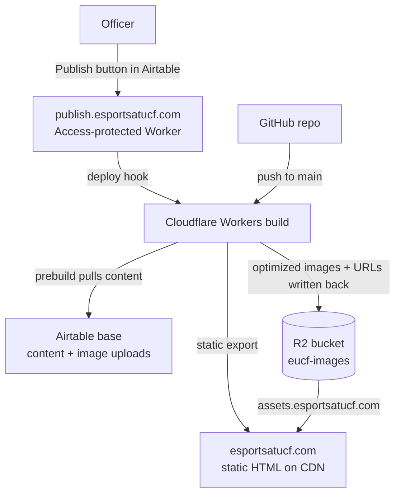

# Infrastructure Setup

For developers standing up this site's hosting — a new Cloudflare account, a rebuilt
Worker, or a handover to the next maintainer.

- Editing content day to day → [Content Runbook](RUNBOOK.md)
- Running the site locally → [README](../README.md)

**No real credentials appear in this file.** Anything in `<angle brackets>` comes from
your own dashboard and belongs in a password manager, never in the repo.

## Before you start

You need admin access to three things:

| System | Owns |
| --- | --- |
| Cloudflare account (club-owned) | the domain, both Workers, R2, Zero Trust (Access) |
| Airtable base (club-owned) | all site content |
| GitHub repository | the code the Worker builds from |

`esportsatucf.com` must already be an **active zone** in that Cloudflare account. Both the
R2 custom domain and the Worker custom domain require it.

## How it fits together



Two things trigger a deploy — an officer pressing **Publish now** on the publish page, and
a developer pushing to `main` — and **both build on Cloudflare**, using the Worker's build
variables. GitHub only stores the code.

GitHub Actions runs lint, typecheck, tests, and a build on every push, but **never
deploys and holds no secrets**. Without Airtable credentials the sync exits 0 and CI
builds against the committed JSON — which carries the real titles, officers, sponsors
and about content, but an intentionally empty `players.json`, so CI renders every game
page in its "Roster coming soon" state. That keeps CI deterministic and keeps
write-scoped production credentials out of a system that runs on every pull request.

## Decisions worth understanding before you change anything

| Decision | Why |
| --- | --- |
| R2 **Standard**, not Infrequent Access | The image library fits inside R2's free 10 GB, so the storage discount applies to zero. IA also charges per-GB retrieval on every CDN cache miss and imposes a 30-day minimum storage duration on images orphaned by replacement. |
| Custom domain, **r2.dev disabled** | `r2.dev` is uncached and rate-limited, intended for development. A custom domain proxies through Cloudflare's CDN: real edge caching, free egress, WAF and Cache Rules coverage. |
| Bucket is **public-read, credential-write** | `assets.esportsatucf.com` serves read-only GETs of individual objects. The S3 API endpoint stays credential-only — no listing, no writes without the token. |
| API token scoped to **one bucket**, no expiry | An expiring token fails *silently* — image sync errors don't fail the build, so the site would publish without new photos and nobody would notice. Rotation is tied to officer turnover instead. |
| Secrets live in **Cloudflare build variables**, not GitHub | See above. Also halves the rotation surface. |
| Publishing goes through an **Access-protected Worker**, not an Airtable script | Airtable's Run script action needs the paid Team plan. The Worker keeps the deploy hook URL as a secret instead of leaving it readable to anyone who can edit the base, and Access records who published. It fits Cloudflare's free tier: a publish is about three Worker requests, Access turns away anyone not signed in before the Worker runs, and the site Worker's static-asset traffic doesn't count toward the request limit. |
| No Tiered Cache, no Hotlink Protection | Content-hash keys with `immutable` headers already cache at the ceiling; misses cost one Class B op against a 10M/month free tier. Hotlink Protection can challenge legitimate image requests, and R2 egress is free. |

> **The bucket is a public asset host.** Anything placed in it is world-readable. Never
> use it for backups, exports, or member data.

## Part 1 — R2 bucket

1. **R2 → Create bucket**
   - Name: `eucf-images`
   - Location hint: **ENAM** (Eastern North America)
   - Storage class: **Standard**

2. **Bucket → Settings → Public access**
   - Leave the **r2.dev subdomain disabled**.
   - **Connect Domain** → `assets.esportsatucf.com`. The zone is in the same account, so
     Cloudflare creates the proxied DNS record itself. Wait for **Active** (SSL issuance,
     usually a minute or two).

3. **Skip CORS.** CORS governs `fetch`/XHR/canvas, not ``. The site is a static
   export using plain ``, so no policy is needed and adding a permissive one would
   only widen the surface.

> Changing the assets hostname is a **two-place change**: the `R2_PUBLIC_BASE_URL`
> environment variable *and* `img-src` in
> [`eucf-website/public/_headers`](../eucf-website/public/_headers). Miss the second and
> every image is blocked by Content-Security-Policy with no server-side error.

## Part 2 — Credentials

### R2 API token

**R2 → API Tokens → Create API Token**

- Permission: **Object Read & Write**. Read is required, not optional — the pipeline sends
  a `HEAD` before every `PUT` to deduplicate.
- Scope: **specify bucket → `eucf-images` only**, not account-wide.
- TTL: **no expiry**.

Save the **Access Key ID** and **Secret Access Key** immediately. The secret is displayed
exactly once; losing it means minting a new token.

Your **Account ID** is on the R2 overview page. It is a separate value from the token.

### Airtable token

**airtable.com/create/tokens**

- Scopes: `data.records:read` **and** `data.records:write`. Write is required — the image
  pipeline writes R2 URLs back into records and clears the upload attachment. With a
  read-only token, images upload to R2 but every build re-uploads them.
- Access: the club's base only.

The **base ID** is the `app…` segment of the base's URL.

## Part 3 — Cloudflare Worker

**Workers & Pages → Create → Import a repository.** When installing the GitHub app,
choose **"Only select repositories"** and pick this one.

| Setting | Value |
| --- | --- |
| Worker name | `eucf-website` — must match `name` in `eucf-website/wrangler.jsonc` |
| Production branch | `main` |
| Root directory | `eucf-website` |
| Build command | `npm run build` |
| Deploy command | `npx wrangler deploy` |

`npm run build` triggers `prebuild`, which runs the Airtable content sync and the image
pipeline before Next.js builds. See [README](../README.md) for what those do.

The Worker has no server code. `eucf-website/wrangler.jsonc` points `wrangler deploy` at the
static export in `out/`. Without that file, wrangler tries to convert the site to OpenNext
and the build fails.

### Build variables

**Settings → Build → Variables and secrets**:

| Variable | Value comes from |
| --- | --- |
| `AIRTABLE_TOKEN` | Part 2 — add as **Secret** |
| `AIRTABLE_BASE_ID` | the base URL |
| `R2_ACCOUNT_ID` | R2 overview page |
| `R2_ACCESS_KEY_ID` | Part 2 — add as **Secret** |
| `R2_SECRET_ACCESS_KEY` | Part 2 — add as **Secret** |
| `R2_BUCKET` | `eucf-images` |
| `R2_PUBLIC_BASE_URL` | `https://assets.esportsatucf.com` — no trailing slash |
| `NODE_VERSION` | `22` — pinned to match CI |

> **Use the Build section.** The Worker also has a runtime **Settings → Variables and
> Secrets** page. The build can't see anything set there, so variables set there are
> treated as absent (see below).

**Why only three are secrets.** A secret is write-only — Cloudflare will not show you the
value again. That is what you want for anything that grants access,
and a nuisance for everything else. The rest are either already public (`R2_BUCKET` and
`R2_PUBLIC_BASE_URL` appear in the repo and in every image URL on the live site) or values
you will want to re-read while debugging — `R2_PUBLIC_BASE_URL` most of all, since it has
to match `img-src` in `public/_headers` exactly or images are silently blocked with no
server-side error.

If any `R2_*` variable is missing the image step skips with a warning and the build still
succeeds.

The Airtable variables have two distinct failure modes:

- **Present but not working** (expired or wrong token, renamed table, Airtable down or
  rate-limiting) — the build **fails**. Rosters exist only in Airtable, so there is
  nothing to fall back to and publishing would strip every roster off the site. The
  previous deploy stays live; see
  [RUNBOOK](RUNBOOK.md#when-a-publish-doesnt-go-through), step 6.
- **Absent entirely** — the sync skips itself and exits 0, because that is how CI builds
  without secrets. On Cloudflare that means a **successful** deploy with no rosters. If
  the site suddenly shows "Roster coming soon" everywhere, check that these variables
  still exist in the Worker's build variables.

### Preview builds

**Settings → Build → Branch control → Builds for non-production branches: off.** CI already
builds every push to `dev`, and a preview build with credentials runs the image pipeline
against the production base. That means unmerged code could write image URLs into live
records and clear officers' upload attachments.

If you want previews later (say, to show officers a redesign before it ships), don't turn
them on while the Airtable and R2 build variables are set, unless you have confirmed a
preview build can't see them. Without credentials the sync skips, and the preview builds
from the committed placeholder content with no effect on production.

### Custom domain

**Settings → Domains & Routes → Add → Custom domain** → add `esportsatucf.com`, plus `www`
if you want it. If an old Pages project still holds the domain, remove it there first.

## Part 4 — Publishing

Officers publish from a small page at `publish.esportsatucf.com`. It is a second Worker,
`eucf-publish`, with its code in
[`eucf-website/workers/publish/`](../eucf-website/workers/publish/). Pressing **Publish
now** makes it POST to the site Worker's deploy hook. Cloudflare Access sits in front of
the page, so only officers on an email allow list can open it, and the hook URL never
leaves Cloudflare.

Set these up in the order below. The Worker also checks every request's Access token
itself, so until Access is in place it refuses everything.

### Deploy hook

**`eucf-website` Worker → Settings → Build → Deploy Hooks**

- Name: `airtable-publish`
- Branch: `main`

Copy the generated URL. A bare `POST` to it starts a build with no authentication, so
anyone who has the URL can trigger builds. It goes only into the publish Worker's secret
below, never into Airtable, the repo, or a chat.

### Access application

**Zero Trust.** The first time, pick a team name and the **Free** plan, which covers 50
users. Cloudflare may ask for a payment method even on Free.

1. **Settings → Authentication:** make sure **One-time PIN** is enabled. Officers sign in
   with a code emailed to them, so they don't need accounts.
2. **Access → Applications → Add an application → Self-hosted**
   - Domain: `publish.esportsatucf.com`
   - Session duration: `24 hours`
3. **Policy:** action **Allow**, include **Emails**, and list the officers who may publish.
4. On the application's overview, copy the **Application Audience (AUD) tag**. Your
   **team domain** is `https://<team-name>.cloudflareaccess.com`.

### Publish Worker

From `eucf-website/`, in a Windows shell:

```bash
npx wrangler login        # sign in to the club's Cloudflare account
npm run deploy:publish    # creates eucf-publish on publish.esportsatucf.com
npx wrangler secret put DEPLOY_HOOK_URL -c workers/publish/wrangler.jsonc
```

Then, under **`eucf-publish` → Settings → Variables and Secrets**, add two plaintext
variables:

| Variable | Value |
| --- | --- |
| `ACCESS_TEAM_DOMAIN` | `https://<team-name>.cloudflareaccess.com`, no trailing slash |
| `ACCESS_AUD` | the AUD tag from the Access application |

These are identifiers, not credentials, so they stay readable. `keep_vars` in
`workers/publish/wrangler.jsonc` stops later deploys from wiping them. Until all three
values exist, the page answers every request with "not configured".

**Under Settings → Domains & Routes, confirm the `workers.dev` route and preview URLs are
disabled.** `wrangler.jsonc` turns both off. If either is ever re-enabled, the page is also
reachable at an address Access doesn't cover. The Worker's own token check would still
refuse those requests, but Access would no longer be screening them first.

The publish Worker isn't connected to Git. After changing its code, redeploy it with
`npm run deploy:publish`.

Failed deploy-hook calls and rejected Access tokens are logged; read them under the
`eucf-publish` Worker's **Observability** tab.

### The `deploy` table

In Airtable, create a table named `deploy` with two fields and **one record**:

| Field | Type | Value in the record |
| --- | --- | --- |
| `name` (primary) | Single line text | `Publish site` |
| `publish` | Button → **Open URL**, label `Publish` | URL formula `"https://publish.esportsatucf.com"` |

Airtable requires the primary field to be text-like, which is why `name` exists. New
tables come with extra fields and a few empty rows; delete them. No automation is needed,
and no code reads this table. The button is only a shortcut; a bookmark to the publish
page works just as well.

> **Who can publish:** only people whose email is on the Access policy. Editing the
> Airtable base does not give anyone publish access.

## Part 5 — Airtable schema

Six **attachment**-type upload columns must exist, named exactly as `F` in
[`scripts/lib/airtable.ts`](../eucf-website/scripts/lib/airtable.ts) expects:

| Table | Upload column | Fills in |
| --- | --- | --- |
| `titles` | `icon upload` | `icon` |
| `players` | `image upload` | `image` |
| `officers` | `image upload` | `image` |
| `sponsors` | `logo upload` | `logo` |
| `featuredstory` | `image upload` | `image` |
| `about` | `image upload` | `image` |

The destination columns must stay **text-ish** (single line, long text, or URL). Converting
one to an attachment field destroys the site-relative paths (`/VALlogo.png`) that static
game logos still use.

Full field contract, including every non-image column:
[RUNBOOK](RUNBOOK.md#airtable-field-contract).

## Verification

1. Put one test image in an `image upload` cell, click **Publish** in the `deploy` table,
   sign in, and press **Publish now**.
2. The page shows "Build started", and a build triggered by `airtable-publish` appears in
   the `eucf-website` Worker's build history.
3. The build log shows
   `[sync-images] 1 attachment(s): 1 uploaded, 0 reused (dedup), 1 record(s) updated, 0 failed.`
4. The Airtable record's `image` column now holds
   `https://assets.esportsatucf.com/images/<sha256>.webp`, and the upload field is empty.
5. `curl -sI https://assets.esportsatucf.com/images/<sha256>.webp` returns `200`,
   `content-type: image/webp`, and `cache-control: public, max-age=31536000, immutable`.
   Run it twice — `cf-cache-status` should go `MISS` then `HIT`, confirming the custom
   domain is CDN-cached rather than hitting R2 every time.
6. Confirm the bucket is not otherwise public: the `*.r2.dev` URL should not serve the
   object, and an unauthenticated request to `*.r2.cloudflarestorage.com` should be
   rejected.
7. Load the live site and check the image renders with no CSP violations in the console.
8. Logged out, `curl -sI https://publish.esportsatucf.com` returns a redirect to
   `<team-name>.cloudflareaccess.com`. The page is never served to someone who hasn't
   signed in.
9. Entering an email that is **not** on the Access policy never receives a code, so the
   page can't be opened.
10. The Worker's `workers.dev` address (`eucf-publish.<subdomain>.workers.dev`) doesn't
    respond. If it ever does, it should answer `403 Forbidden`, since the request carries
    no Access token; turn the route back off either way.

## Rotating credentials

Do this at officer turnover, or immediately if a credential may have leaked.

**R2 token** — R2 → API Tokens → create a replacement (same scope: `eucf-images`, Object
Read & Write) → update `R2_ACCESS_KEY_ID` and `R2_SECRET_ACCESS_KEY` in the Worker's build
variables → redeploy to confirm → revoke the old token.

**Airtable token** — same shape: create with `data.records:read` + `data.records:write`,
update `AIRTABLE_TOKEN` in the Worker's build variables, redeploy, revoke the old one.

**Deploy hook** — delete and recreate it under **`eucf-website` → Settings → Build →
Deploy Hooks**, then store the new URL by running this from `eucf-website/`:
`npx wrangler secret put DEPLOY_HOOK_URL -c workers/publish/wrangler.jsonc`. Press
**Publish now** once to confirm.

**Who can publish** — update the email list in the Access policy, and remove departed
officers under **Zero Trust → Users** to free their seats on the 50-user free plan.

Create each replacement *before* revoking the old one, and confirm with a real deploy in
between. The two tokens fail differently:

- **A bad Airtable token fails the build**, and the previous deploy stays live.
- **A bad R2 token only skips images**: uploads fail, but the build still succeeds.
  R2 is only contacted when an upload is pending, so rotate with a test image waiting in
  an `image upload` cell and check the build log's `[sync-images]` summary line.
